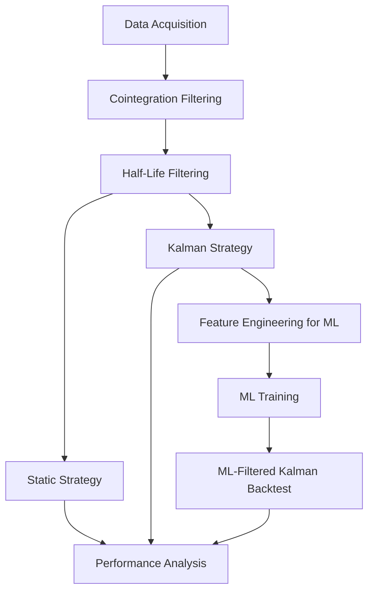

# Project

An **end-to-end quantitative trading system** combining:
- **Statistical Arbitrage** (Pairs Trading)
- **Kalman Filter Dynamic Hedge Ratios**
- **Machine Learning Trade Filtering (Random Forest)**

This project implements the complete pipeline from **raw market data → signal generation → backtesting → ML model training → forward testing → performance analysis**.

---

## 🚀 Project Overview

This project progresses in **three strategy stages**:
1. **Static Hedge Ratio Strategy** – Baseline using fixed β from OLS.
2. **Kalman Filter Strategy** – Adaptive β and α over time.
3. **ML + Kalman Strategy** – Kalman signals filtered by a trained Random Forest classifier.

Each step builds on the previous one, improving accuracy, win rate, and risk-adjusted returns.

---

## 📂 Folder Structure
```
├── Data Files/
├── Data Preparation and Filtering/
├── Static/
├── Kalman/
├── ML+Kalman/
├── Results/
└── README.md
```
---

## 1️⃣ Data Files

**Purpose:** Store all raw and processed CSV data.  
- S&P 500 historical price data (chunked for efficiency).  
- VIX dataset for market regime features.  
- Outputs from preparation scripts.

---

## 2️⃣ Data Preparation and Filtering

Transforms raw market data into a **refined list of tradable pairs**.

**Scripts:**
- **`install_libraries.py`** – Installs all required packages automatically.
- **`data.py`** – Downloads & saves S&P 500 and VIX historical data.
- **`cointegration.py`** – Filters pairs with:
  - Engle-Granger cointegration test
- **`half-life.py`** – Calculates half-life of mean reversion; filters slow pairs.

**Outputs:** CSVs of final candidate pairs.

---

## 3️⃣ Static Strategy

**Baseline Strategy** – Fixed β from OLS regression.

**Scripts:**
- **`static.py`** – Calculates z-scores for all pairs and saves in 700+ CSVs.
- **`static-backtest.py`** –  
  - **Entry:** Long when z-score < -3, Short when z-score > 3  
  - **Exit:** Close when z-score crosses 0.5  
  - Equal allocation across open positions.

---

## 4️⃣ Kalman Strategy

**Adaptive Strategy** – Dynamic β and α via Kalman Filter.

**Scripts:**
- **`kalman.py`** – Generates dynamic hedge ratios & z-scores for all pairs.
- **`kalman-backtest.py`** – Same rules as static but with adaptive β.

---

## 5️⃣ ML + Kalman Strategy

Adds **machine learning trade filtering** to improve win rate & returns.

**Scripts:**
- **`ml-kalman-data-collection.py`** – Adds technical, spread, correlation, and market regime features.
- **`ml-backtest.py`** – Logs features at trade entry for training.
- **`rf_model.py`** – Trains Random Forest classifier to predict trade profitability.
- **`ml-forward-test.py`** – Collects features for forward test period.
- **`ml-forward-backtest.py`** – Runs Kalman backtest with ML trade filtering.

---

## 6️⃣ Results

Performance metrics generated using `backtest-general.py`.  

**Final Out-of-Sample Results:**

| Metric | Static | Kalman | ML + Kalman |
|--------|--------|--------|-------------|
| Compounded Return | 13.83% | 20.06% | **26.87%** |
| Annualized Return | 9.39% | 13.49% | **17.91%** |
| Sharpe (4% RF) | 2.17 | 2.43 | **2.95** |
| Sortino (4% RF) | 5.10 | **7.84** | 7.07 |
| Max Drawdown | -0.02% | -0.01% | -0.02% |
| Win Rate | **78.38%** | 72.92% | 77.57% |
| Avg Win ($) | **6,389** | 4,056 | 4,127 |
| Avg Loss ($) | -5,869 | -3,206 | -3,079 |
| Expected Value ($) | **3,739** | 2,089 | 2,511 |

---

## 📊 Strategy Pipeline



## ⚡ Quick Start

**1. Clone the repository**

```bash
git clone https://github.com/Taghi-Guliyev/ml-kalman-pairs-trading.git
cd ml-kalman-pairs-trading
```

2. Install dependencies

```bash
python "Data Preparation and Filtering/install_libraries.py"
```

3. Run the pipeline in sequence

   Data Preparation

Fetch and save S&P 500 and VIX data
```bash
python "Data Preparation and Filtering/data.py"
```

   Run cointegration tests and filter pairs
```bash
python "Data Preparation and Filtering/cointegration.py"
```

   Calculate half-life of mean reversion for pairs
```bash
python "Data Preparation and Filtering/half-life.py"
```
Static Strategy

   Generate z-scores for all candidate pairs (static hedge ratio)
```bash
python Static/static.py
```

   Backtest the static hedge ratio strategy
```bash
python Static/static-backtest.py
```

Kalman Strategy

   Generate z-scores for all candidate pairs (dynamic hedge ratio via Kalman filter)
```bash
python Kalman/kalman.py
```

   Backtest the Kalman filter strategy
```bash
python Kalman/kalman-backtest.py
```

ML + Kalman Strategy

   Generate z-scores and ML features for all candidate pairs
```bash
python "ML+Kalman/ml-kalman-data-collection.py"
```

   Backtest Kalman strategy and save trade logs with features
```bash
python "ML+Kalman/ml-backtest.py"
```

   Train Random Forest model on historical trade outcomes
```bash
python "ML+Kalman/rf_model.py"
```

   Forward test without ML filtering to verify data alignment
```bash
python "ML+Kalman/ml-forward-test.py"
```

   Backtest with Kalman + ML model to filter trades
```bash
python "ML+Kalman/ml-forward-backtest.py"
```


